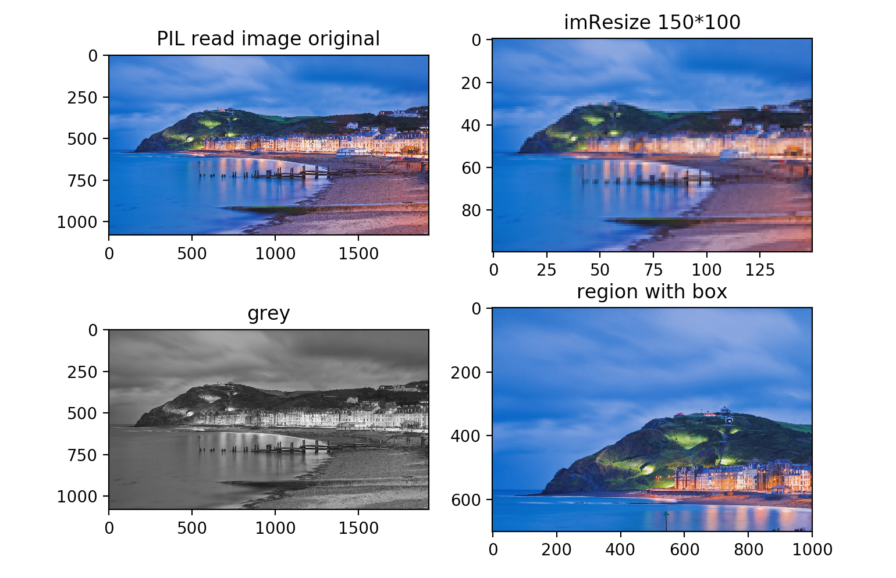

## Python TP

PENG Hanyuan & YAN Wenli

---

> Les codes du TP sont fournis dans le fichier `Code_TP.zip`. (Python3.6)


### TP1 - Fichiers

Ce sujet nous permet d'utiliser:
- Les fichiers: Lecture et l'écriture d'un fichier,
- Classe: Surcharge des méthodes, getter, setter.


#### Fichier

Quand nous voulons lire un fichier text (ou json, xml etc..), c'est mieux d'indiquer le codage de fichier pour que les textes affiche correctement.

``` python
def func():
    print(' Bonjour le monde !')
    print('\t1. Choisir un nom de fichier','\t2. Ajouter un texte','\t3. Afficher le fichier complet', '\t4. Vider le fichier', '\t5. Quitter',sep='\n')

    filename = ''
    while True:
        inp = input('Votre choix: ')
        if inp == '1':
            filename = input('Nom de fichier: ')
            print('Nom du fichier:', filename)
        elif inp == '2':
            if not filename:
                print('Choisir un nom de fichier!')
            else:
                print('Nom du fichier: ', filename)
                with open(filename, "a", encoding="utf-8") as fic:
                    text = input("Votre Texte: ")
                    fic.write(text)
        elif inp == '3':
            if not filename:
                print('Choisir un nom de fichier!')
            else:
                print('Nom du fichier: ', filename)
                with open(filename, "r", encoding="utf-8") as fic:
                    print(fic.read(),end='\n')
        elif inp == '4':
            with open(filename, "w+") as fic:
                fic.truncate()
        elif inp == '5':
            break
        else:
            raise Exception("Error input, programme va quitter")


if __name__ == "__main__":
    try:
        func()
    except Exception as e:
        print(e)
```

###### Résultat:


#### Classe

##### Surcharge des méthodes

``` python
class Date:
    def __init__(self,date):
        self.date = date
    def __eq__(self, other):
        if other.date == self.date:
            return True
        else:
            return False
    def __lt__(self,other):
        if self.date < other.date:
            return True
        else:
            return False

date = Date(1.2)
date2 = Date(1.3)

print(date > date2)

```

###### Résultat:


###### Des point importants

Il faut utiliser le nom particulier pour surcharger les opérateur (+, =, <, etc)


##### Attributs et Getter, Setter

> Des codes de cette partie sont dans le `Code_TP.zip`. Fichier `tp1_etudiant.py`

Résultat:


### TP2 - Tkinter
#### 2.1 Introduction simple
Tkinter (de l'anglais Tool kit interface) est la bibliothèque graphique libre d'origine pour le langage Python, permettant la création d'interfaces graphiques. Tkinter est intégré au paquet d'installation de python pour gérer rapidement des interfaces graphiques simples.


Tkinter offre une variété de composant d'interface graphique tels que `Boutons`, `Label`, `Frame`, `Canvas`, `Text`, `Menu`, `Message`, `Scrollbar`,etc.

Il possède des attributs standards comme: `Dimension`, `Color`, `Font`, `Cusor`, `Anchor`, etc.

Le composant d'interface graphique de Tkinter a une méthode de gestion d’état géométrique spécifique qui gère l’organisation complète de la zone de contrôle. Voici les trois classes de gestion de géométrie exposée par Tkinter: `package()`, `grid()`, `place()`.

#### 2.2 Travail du TP
Une calculatrice avec deux mode(standard et scientifique) réalisée par la bibliothèque `Math` et `Tkinter`. Ici, on a utilisé `grid()`:

```python
def calBasique():
    global bg
    bg.title('Calculatrice')
    for btn in list_button_sci:
        btn.destroy()
    # bg.update_idletasks()
    # bg.geometry(400*200)
    global entry
    entry = Entry(justify='right')
    entry.grid(row=0, column=0, columnspan=5, sticky=N+W+S+E)

    button_c = Button(text='C', relief=RIDGE,width=5, command =lambda : clear(entry)).grid(row=4,column=1)
    button0 = Button(text='0', relief=RIDGE,width=5, command =lambda : get_input(entry,'0')).grid(row=4,column=2)
    button_ac = Button(text='AC', relief=RIDGE,width=5, command =lambda : all_clear(entry)).grid(row=4,column=3)

    button1 = Button(text='1', relief=RIDGE,width=5, command =lambda : get_input(entry,'1')).grid(row=3,column=1)
    button2 = Button(text='2', relief=RIDGE,width=5, command =lambda : get_input(entry,'2')).grid(row=3,column=2)
    button3 = Button(text='3', relief=RIDGE,width=5, command =lambda : get_input(entry,'3')).grid(row=3,column=3)

    button4 = Button(text='4', relief=RIDGE,width=5, command =lambda : get_input(entry,'4')).grid(row=2,column=1)
    button5 = Button(text='5', relief=RIDGE,width=5, command =lambda : get_input(entry,'5')).grid(row=2,column=2)
    button6 = Button(text='6', relief=RIDGE,width=5, command =lambda : get_input(entry,'6')).grid(row=2,column=3)

    button7 = Button(text='7', relief=RIDGE,width=5, command =lambda : get_input(entry,'7')).grid(row=1,column=1)
    button8 = Button(text='8', relief=RIDGE,width=5, command =lambda : get_input(entry,'8')).grid(row=1,column=2)
    button9 = Button(text='9', relief=RIDGE,width=5, command =lambda : get_input(entry,'9')).grid(row=1,column=3)


    button_plus = Button(text='+', relief=RIDGE,width=5, command =lambda : get_input(entry,'+')).grid(row=1,column=4)
    button_minus = Button(text='-', relief=RIDGE,width=5, command =lambda : get_input(entry,'-')).grid(row=2,column=4)
    button_multi = Button(text='*', relief=RIDGE,width=5, command =lambda : get_input(entry,'*')).grid(row=3,column=4)
    button_div = Button(text='/', relief=RIDGE,width=5, command =lambda : get_input(entry,'/')).grid(row=4,column=4)

    button_point = Button(text='.', relief=RIDGE,width=5, command =lambda : get_input(entry,'.')).grid(row=5,column=2)
    button_equ = Button(text='=', relief=RIDGE,width=5, command =lambda : cal(entry)).grid(row=5,column=3)
```
Pour chaque opération, on a défini sa fonction en utilisant des méthodes de `Math`, par exemple `calSin`(C'est pareil pour les autres opérations):
```python
def calSin(entry):
    input = entry.get().strip()
    resultSin = math.sin((int(input)/180)* math.pi)
    all_clear(entry)
    entry.insert(END, resultSin)
```
Les résultats:


### TP3 - Exceptions et chiffrement

#### Exceptions et assertion

Pour la partie de exceptions et assertion, nous les avons ajouté dans les tps précédents.

#### Chiffrement

Nous avons fait une interface ci-dessous avec Tkinter pour réaliser cette partie.


Après avoir saisi le login et mot de passe, vous pouvez cilquer `Store info` pour stocker les informations dans un fichier `userinfo.json`.


Les mot de passe sont chiffrés par algorithme `sha256` en utilisant le `'salt'`.

```python
password = salt + password + login
mdp = hashlib.sha256(password.encode()).hexdigest()
```
Ensuite vous pouvez cliquer `verify` pour verifier les info. Il y aura un message box qui indique si le résultat est correct.


Vous pouvez aussi cliquer `crypto`. Il va afficher une autre fenêtre sur laquelle vous pouvez saisir un nom de fichier existe pour le chiffrer dans un autre fichier binaire.


Les codes complète sont dans le fichier `TP3.py`.


### TP4 - Matplotlib
#### 4.1 Introduction simple
Matplotlib est une bibliothèque du langage de programmation Python destinée à tracer et visualiser des données sous formes de graphiques.Elle peut être combinée avec les bibliothèques python de calcul scientifique NumPy et SciPy.

Plusieurs points intéressants de Matplotlib:

- Export possible en de nombreux formats matriciels (PNG, JPEG...) et vectoriels (PDF, SVG...)
- Documentation en ligne en quantité, nombreux exemples disponibles sur internet
- Forte communauté très active
- Interface pylab : reproduit fidèlement la syntaxe MATLAB
- Bibliothèque haut niveau : idéale pour le calcul interactif

Il peut réaliser plusieurs types de graphiques:
- Graphique linéaire
- Nuage de points
- Carte de contour
- Diagramme à barres
- L'histogramme
- Graphiques 3D,
- Même des animations graphiques et ainsi de suite.

#### 4.2 Travail du TP
J'ai créé une interface avec des buttons et un menu en haut qui contient tous ce qu'on a fait de ce TP. L'utilisateur peut faire des opérations depuis cette interface (comme ci-dessous).


Afficher la courbe de ces données dans une fenêtre matplotlib et afficher plusieurs courbes avec styles et couleurs variés (voir fig1 et fig2), et puis modifier les noms des axes, la légende, ajouter des flèches pour montrer des zones(voir fig3):
```python
def drawScatter():

    global plot
    plot.figure('Scatter fig')

    ax = plot.gca()
    ax.set_xlabel('x')
    ax.set_ylabel('y')

    l1 = ax.scatter(numbers_x, numbers_y, c='g', marker = 'o', s=10, alpha=0.5)
    l2 = ax.scatter(numbers_x, numbers_y2, c='blue', marker = '*', s=10, alpha=0.5)

    plot.plot([0, 10], [0, 30], color = 'red', linestyle = 'solid')
    plot.annotate(text="this point is important", xy=(5, 15), xytext=(6, 16),arrowprops={"arrowstyle":"->"})

    plot.legend(handles = [l1, l2,], labels = ['a', 'b'], loc = 'best')
    plot.show()
```


```python
def drawLine():
    global plot
    plot.figure('Line fig')
    # plot.xlabel('X axis')
    # plot.ylabel('Y axis')
    ax = plot.gca()
    ax.set_xlabel('x')
    ax.set_ylabel('y')

    g1 = ax.plot(numbers_x, numbers_y, c='r', linewidth=1, alpha=0.6)
    g2 = ax.plot(numbers_x, numbers_y2, color='#054E9F', linewidth=1, alpha=0.6)
    g3 = ax.plot(numbers_x, numbers_y3, color='#1DF09B', linewidth=1, alpha=0.6)
    plot.legend(handles = [g1,g2,g3,], labels = ['line1', 'line2','line3'], loc = 'best')
    plot.show()
```


Afficher un histogramme et un camembert:
```python
def drawHisto():

    global plot
    plot.figure('Historique Bar fig')
    ax = plot.gca()
    ax.set_xlabel('value')
    ax.set_ylabel('count')

    xticks = np.arange(1, len(numbers_x)+1)
    bar_width=0.5

    ax.bar(xticks, numbers_y, width=bar_width, edgecolor='none')
    ax.set_xticks(xticks)

    ax.set_xticklabels(numbers_x)
    ax.set_xlim(0,len(xticks))
    plot.show()
```

```python
def drawCamenbert():

    plot.figure('Camenbert fig',figsize = (5, 5))
    x = [1, 2, 3, 4, 10]
    plot.pie(x, labels = ['A', 'B', 'C', 'D', 'E'],
           colors = ['red', 'green', 'yellow', 'blue', 'pink'],
           explode = [0, 0.2, 0, 0, 0],
           autopct = lambda x: str(round(x, 2)) + '%',
           pctdistance = 0.7, labeldistance = 0.4,
           shadow = True)
    plot.legend(loc='upper left')
    plot.show()
```


Mais on a trouvé qu'on peut ouvrir qu'une image chaque fois donc on a apris comment mettre plusieurs figures dans une fenêtre en utilisant `subplot`:
```python
def showAllFigs():
    fig = plot.figure()
    ax1 = fig.add_subplot(223)
    ax2 = fig.add_subplot(221)
    ax3 = fig.add_subplot(222)
    ax4 = fig.add_subplot(224)

    ax1.plot(range(5), color = 'blue')
    ax2.bar(range(5), range(5), color = 'green')
    ax3.plot(range(5), color = 'red')
    ax4.plot(range(5), color = 'black')
```


Afficher une surface 2D dans un espace 3D (mesh):
```python
def mesh_2d_3d():
    fig = plot.figure('3D Mesh fig') #titre
    ax = fig.add_subplot(111, projection='3d') #une image en 3D

    x = np.random.sample(100)
    y = np.random.sample(100)

    ax.set_xlim(0, 1)
    ax.set_ylim(0, 1)
    ax.set_zlim(0, 1)
    ax.set_xlabel('X')
    ax.set_ylabel('Y')
    ax.set_zlabel('Z')

    ax.scatter(x, y, zs=0, zdir='y', label='points in (x,z)')
    ax.legend()
    plot.show()
```


Les deux images ci-dessus sont 2D dans un espace 3D, en plus on a essayé de faire un graphe 3D dans un espace 3D:
```python
def mesh_3d():
    fig = plot.figure('3D Mesh fig')
    ax = fig.add_subplot(111, projection='3d')

    x = y = np.arange(-3.0, 3.0, 0.05)
    X, Y = np.meshgrid(x, y)
    zs = np.array([fun(x,y) for x,y in zip(np.ravel(X), np.ravel(Y))])
    Z = zs.reshape(X.shape)

    ax.plot_surface(X,Y,Z)
    plot.show()
```


#### Conclusion
Après des recherches et études, on peut trouver que cet outil Matplotlib est très pratique, il peut faire nombreux types de figures avec plusieurs attributs, comme couleur, forme, taille etc. Il peut bien montrer des données avec une façon visuelle.


### TP5 - Base de données
#### 5.1 Introduction simple - SQLite3
SQLite3 est une bibliothèque de gestion de bases de données relationnelle. Elle est déjà en général installée (windows, linux...).
Commandes indispensables : create, select...from..., insert.
#### 5.2 Travail du TP
##### 5.2.1 Création de la base de donnée.
On a lit des fichiers `.csv` et parsé des informations dans ces fichiers. On a crée une base de donnée qui contient des classes correspondantes à chaque ficher, `Regions`, `Departements`, `Communes`.

`Attention:` Si la base de donnée existe déjà, on ne peut plus la générer à nouveau, si nécessaire supprimez-la du dossier TP5.

Par exemple:
```python
# conding=utf-8
from sqlalchemy import *
from sqlalchemy.ext.declarative import declarative_base
from sqlalchemy.orm import sessionmaker
import csv
from sqlalchemy.orm import relationship
import xml.etree.ElementTree as ET

engine = create_engine('sqlite:///database_tp5.db:', echo=False)
Base = declarative_base()

class Departements(Base):
    __tablename__ = 'departements'
    code_departement = Column(String(50), primary_key=True)
    nom_departement = Column(String(50))
    nb_arrondi = Column(Integer)
    nb_canton = Column(Integer)
    nb_commune = Column(Integer)
    population_municpale = Column(Integer)
    population_totale = Column(Integer)

    code_region = Column(Integer, ForeignKey('regions.code_region'))
    region = relationship("Regions", back_populates="departements")

    communes = relationship("Communes", back_populates="departements")

    #...
    Base.metadata.create_all(engine)
```

```python
with open('data_Base_de_donnees/departements.csv', newline='', encoding = 'ISO-8859-1') as csvfile:
    count = 0;
    spamreader = csv.reader(csvfile, delimiter=';')
    for row in spamreader:
        count += 1;
        if count > 8:
            departement = Departements()
            departement.code_region = row[0]
            departement.code_departement = row[2]
            departement.nom_departement = row[3]
            departement.nb_arrondi = row[4].replace(' ', '')
            departement.nb_canton = row[5].replace(' ', '')
            departement.nb_commune = row[6].replace(' ', '')
            departement.population_municpale = row[7].replace(' ', '')
            departement.population_totale = row[8].replace(' ', '')
            session.add(departement)
    session.commit()
```


On a appris comment creer la base de donnée avec des class et comment définir des attributs et des realtions tels que la clé étrangère.

##### 5.2.2 Calculer et afficher les populations totales de chaque département et région.
On fait des requêtes de la base de donnée en utilisant `session.query()`.

```python
def comparerPopulations():
    for row in session.query(Regions).all():
        totale_region = 0
        for departement_item in row.departements:
            totale_region += departement_item.population_totale
        print(row.nom_region, totale_region)
```  


##### 5.2.3 Requêtes
Déterminer les communes ayant le même nom et un département différent. Afficher le nom de la commune suivi de la liste des n° de départements.
```python
def trouverMemeNom():
    lstCommunes = session.query(distinct(Communes.nom_commune)).all() #return colonne nom_commune

    for row in lstCommunes:
        print("------------------------------------------")
        # print(row[0]) #print le nom de commune
        lstDepartements = session.query(Communes.nom_commune.label('nom_commune'), Communes.code_departement.label('code_departement')).filter(Communes.nom_commune == row[0]).all()

        for d in lstDepartements:
            print(d[0],"\t\t", d[1])
```


##### 5.2.4 Sauvegarde et lecture de base de données (xml)
Ecrire une fonction pour sauvegarder la base dans un fichier XML et une autre pour charger la base à partir de ce fichier.

Sauvegarde au xml: une fonction pour sauvegarder la base dans un fichier XML.
```python
def xml_to_database():
    tree = ET.parse('Regions.xml')
    root = tree.getroot()
    # print('root-tag:',root.tag,',root-attrib:',root.attrib,',root-text:',root.text)
    for child in root:
        region = Regions()
        region.code_region = child.find('code_region').text
        region.nom_region = child.find('nom_region').text
        region.nb_arrondi = child.find('nb_arrondi').text
        region.nb_canton = child.find('nb_canton').text
        region.nb_commune = child.find('nb_commune').text
        region.population_municpale = child.find('population_municpale').text
        region.population_totale = child.find('population_totale').text
        session.add(region)
    session.commit()
```


Lecture depuis xml: une fonction pour charger la base à partir de ce fichier.
```python
with open(nomFichier, "a") as outfile:

    rows_regions = session.query(Regions).all()
    outfile.write('<?xml version="1.0" ?>\n')
    outfile.write('<mydata>\n')
    for row in rows_regions:
        outfile.write('  <row>\n')
        outfile.write('    <code_region>%s</code_region>\n' % row.code_region)
        outfile.write('    <nom_region>%s</nom_region>\n' % row.nom_region)
        outfile.write('    <nb_arrondi>%s</nb_arrondi>\n' % row.nb_arrondi)
        outfile.write('    <nb_canton>%s</nb_canton>\n' % row.nb_canton)
        outfile.write('    <nb_commune>%s</nb_commune>\n' % row.nb_commune)
        outfile.write('    <population_municpale>%s</population_municpale>\n' % row.population_municpale)
        outfile.write('    <population_totale>%s</population_totale>\n' % row.population_totale)

        outfile.write('  </row>\n')
    outfile.write('</mydata>\n')
```

##### 5.2.5 Ajout d'une table NouvellesRegions
```python
def addNouvellesRegions():
    spamreader = csv.reader(csvfile, delimiter=';')
    for row in spamreader:
        count += 1;
        if count > 8:
            print(row)
            region = Regions()
            region.code_region = row[0]
            region.nom_region = row[1]
            region.nb_arrondi = row[2].replace(' ', '')
            region.nb_canton = row[3].replace(' ', '')
            region.nb_commune = row[4].replace(' ', '')
            region.population_municpale = row[5].replace(' ', '')
            region.population_totale = row[6].replace(' ', '')
            session.add(region)
    session.commit()
```


### TP6 - Numpy et Scipy
Dans ce TP, on a bien compris des fonctionnalités et des caractéristiques de Numpy et Scripy en réalisant tous les exercices.

Nous avons créé trois fichers:
`tp6.py`(Numpy),
`tp6_scripy.py`  (Scripy)
`tp6_matplotlib_image.py`(qui utilise PIL pour réaliser des operations sur l'image)
#### 6.1 Numpy
##### 6.1.1 Introduction simple
NumPy est le paquet fondamental du calcul scientifique et une bibliothèque tierce essentielle à l'analyse de données en Python.

L'émergence de np résout dans une certaine mesure le problème des performances informatiques médiocres en Python, en même temps le fournisse des types de données plus précis. On peut dire que NumPy est la bibliothèque la plus élémentaire de traitement de données ou de calcul scientifique.

Il contient:
- Un puissant objet tableau N-dimensionnel
- Fonctions sophistiquées (diffusion)
- Outils d'intégration de code C / C ++ et Fortran
- Algèbre linéaire utile, transformée de Fourier et capacités de nombres aléatoires

##### 6.1.2 Travail du TP
###### Afficher des attributs du tableau
```python
def creationA():
    #Créer un tableau de dimension 3 avec un shape de (4, 3, 2) remplit avec des nombres aléatoires.
    a1 = np.random.empty(0,10,size=[4,3,2])

    #Vous afficherez les attributs du tableau : ndim, shape, size, dtype, itemsize, data.
    print(a1)
    print("ArrayType: ",type(a1))
    print("DataType: ",a1.dtype)
    print("ArraySize: ",a1.size)
    print("ItemSize: ",a1.itemsize)
    print("ArrayShape: ",a1.shape)
    print("data: ",a1.data)
    print("ArrayDimension: ",a1.ndim)
```
Résultats:
int:

float:


###### Des opérations sur array avec Numpy
On a créé deux matrices pour faire le `+`,`dot`, `*`, `multiply` et `transposer`.

```python
b1_arr = np.arange(0,9).reshape(3,3)   # ne contient pas 9  (0-8)
b2_arr = np.arange(2,11).reshape(3,3)   # ne contient pas 11  (2-10)
b1_mat = np.mat(b1_arr)
b2_mat = np.mat(b2_arr)
```

Pour bien comprendre les différences des opérations pour Array et Matrice, on a testé avec les deux:
```python
print("----------------- array ---------------------------")
print("b1_mat\n",b1_arr)
print("b2_mat\n",b2_arr)

print("+\n", b1_arr + b2_arr)
print("dot\n", np.dot(b1_arr, b2_arr))
print("*\n", (b1_arr) * (b2_arr))
print("multiply\n", np.multiply(b1_arr, b2_arr))
print("transposer\n", np.transpose(b1_arr))
```


```python
print("----------------- matrice ---------------------------")
print("b1_mat\n",b1_mat)
print("b2_mat\n",b2_mat)
print("+\n", b1_mat + b2_mat)
print("dot\n", np.dot(b1_mat, b2_mat))
print("*\n", (b1_mat) * (b2_mat))
print("multiply\n", np.multiply(b1_mat, b2_mat))
print("transposer of b1_mat: \n", np.transpose(b1_mat))
```


Selon les résulats, on peut faire la conclusion:
- `dot`: Pour un tableau de rang 1, effectuez la multiplication de position correspondante puis faire la somme；pour un tableau à deux dimensions dont le rang n'est pas égal à 1, effectuez la multiplication matricielle.
- `*`:  Effectuer la multiplication de position correspondante sur le tableau; effectuer une multiplication matricielle sur des matrices.

###### Autres opérations sur matrice
Calculer le déterminant, l’inverse, les valeurs et vecteurs propres d’une matrice.

```python
print("det of b1_mat: \n", np.linalg.det(b1_mat))
#le déterminant égale à 0, ce matrice est invertible
try:
    inverse = np.linalg.inv(b2_mat)
    print("inverse of b2_mat: \n", inverse)
except np.linalg.LinAlgError:
    print("Not invertible. Skip this one.") #Si non invertible. Passer à la suite
    pass
else:
    print("ok")
eig1,eig2 = np.linalg.eig(b1_mat)
print("the eig of mat is:\n",eig1)
print("the feature vector of mat is:\n",eig2)
```


#### 6.2 Scipy
##### 6.2.1 Introduction simple
SciPy est un module dans Python construit sur Numpy qui intègre plusieurs algorithmes mathématiques et des fonctions pratiques. En fournissant aux utilisateurs des commandes et des classes de haut niveau, SciPy augmente considérablement la possibilité de manipuler et de visualiser les données dans des sessions interactives Python.

SciPy contient des modules:
- Optimisation
- Algèbre linéaire
- Intégration
- Interpolation
- Fonctions spéciales
- Transformée de Fourier rapide
- Traitement du signal et de traitement d'images
- Résolution d'équations différentielles ordinaires
- D'autres calculs couramment utilisés en science et en ingénierie.

##### 6.2.2 Travail du TP
###### Approcher un ensemble de points par une courbe
Pour une solution polynomiale simple,on peut utiliser simplement la fonction numpy: `polyfit (x, y, degree)`.
Pour le fitting exponentiel et puissant, on peut utiliser curve_fit dans `scipy.optimize`

Donc on a fait des exercices avec deux façons:
```python
def polyfitting_1():

    x = np.arange(1, 16, 1)
    num = [4.00, 5.20, 5.900, 6.80, 7.34,
           8.57, 9.86, 10.12, 12.56, 14.32,
           15.42, 16.50, 18.92, 19.58, 20.00]
    y = np.array(num)

    #Fit avec un polynôme cubique
    f1 = np.polyfit(x, y, 3)
    p1 = np.poly1d(f1)
    print(p1)

    #Fit y value
    # methode2: yvals=np.polyval(f1, x)
    yvals = p1(x)

    #Dessiner un graphe
    plot1 = plt.plot(x, y, 's',label='original values')
    plot2 = plt.plot(x, yvals, 'r',label='polyfit values')
    plt.xlabel('x')
    plt.ylabel('y')
    plt.legend(loc=4) #legend:right-down
    plt.title('polyfitting_1_numpy')
    plt.show()
    plt.savefig('test.png')
```

```python
def polyfitting_2():
    xdata = np.linspace(0, 4, 50)
    y = func(xdata, 1.5, 2.3, 0.5)
    ydata = y + 0.2 * np.random.normal(size=len(xdata))
    plt.plot(xdata,ydata,'b-',label='data')
    #Ajustement des moindres carrés non linéaire
    popt, pcov = curve_fit(func, xdata, ydata)
    #popt[], trois inconnus en attente de résolution a,b,c
    y2 = [func(i, popt[0],popt[1],popt[2]) for i in xdata]
    plt.plot(xdata,y2,'r--',label='fit')
    plt.title('polyfitting_2_scripy')
    plt.legend()
    plt.show()
    print(popt)
```


#### 6.3 Traitement sur images
Pour mieux comparer, on a récupéré tous les résultats ensemble:
Pour lire une image jpeg: `matplotlib.imread` ne marche que sur le format`.png` mais pas sur `.jpg`, alors après des tests sur toutes les façons possibles, on a choissi `PIL`.

et afficher l’image originale et réduite en taille
```python
test_image = Image.open(imagepath_2)
imResize = test_image.resize((150,100), Image.ANTIALIAS)
l_image = test_image.convert('L')
box = (0, 0, 1000, 700)             
region = test_image.crop(box)

plt.subplot(221)
plt.title('PIL read image original')
plt.imshow(test_image)
plt.subplot(222)
plt.title('imResize 150*100')
plt.imshow(imResize)
plt.subplot(223)
plt.title('grey')
plt.imshow(l_image)
plt.subplot(224)
plt.title('region with box')
plt.imshow(region)
plt.show()
```


### TP7 - Serveur et page web (Django)

Nous avons essayé de lancer un server avec les codes fournis.


Pour la partie login et afficher les données, nous avons utilisé `Django`.

#### Login et afficher les données
Afin de lancer le projet django, il faut entrer dans le dossier `TP7` et exécuter la command `python3 manage.py runserver` (ou `manage.py runserver` sous Windows).

Nous avons fait une interface web pour que les utilisateur puissent connecter au système avec login et mot de passe. Le URL de la page login est [http://localhost:8000/site](http://localhost:8000/site).


- **Username** : admin
- **Password** : password

Si le login ou le mot passe n'est pas correct, il y aura une message d'erreur.


Après accéder à la page d'accueil ( [http://localhost:8000/site/index](http://localhost:8000/site/index) ) avec le login et mot de passe, il y aura une liste des informations des étudiants. Nous avons stocké ces informations dans la base de données et les récupérer avec django.

> Le status de login est stocké dans le COOKIES donc vous pouvez rester connecter dans 3600 secondes.

Nous avons créé des `template` pour afficher les résultat et des modèles pour stocker ou récupérer les données depuis base de données.

```python
def index(req):
    username = req.COOKIES.get('username','')
    etudiants = Etudiant.objects.all()

    return render_to_response('index.html' ,{'username':username, 'etudiants':etudiants})
```

```html
<table>
    <thead>

      <td>Nom</td>
        <td>Prenom</td>
    <td>Age</td>
    </thead>
  
    <tr>
      <td>{{e.nom}}</td>
        <td>{{e.prenom}}</td>
        <td>{{e.age}}</td>
    </tr>
  
</table>
```

Les codes complètes sont dane le dossier `TP7/tp7_site`.


### TP8 - Prog. asynchrone et fourmis
#### Prog. asynchrone
Nous avons testé une même calcul ci-dessous avec `multithread` et `multiprocessing`.

```python
def calcul_long():
    n = 1E7
    while n>0:
        n -= 1
```

##### Multi-thread (5 threads)


##### Multi-processing (5 processus)


Pour ce calcul, multi-processing est plus vite que multi-threads.

#### Peinture avec fourmis
Afin de faire dessiner, nous avons utilisé `numpy` pour générer une matrice de dimension `500*500*3` pour stocker les pixels. Et nous avons utiliser `scipy` pour stocker la matrice dans une fichier image.

Pour les paramètres, nous avons utilisé un fichier `.xml` pour passer les paramètres au programme.

La commande: `python3 ant.py nom_du_fichier.xml`

exp:


Le fichier `fourmis.xml`:

```xml
<parametres nombre="2" iteration="100000">
<fourmis>
   <couleur_deposee>192, 0, 255</couleur_deposee>
   <couleur_suivi>255, 155, 3</couleur_suivi>
   <proba>0.04,0.95,0.01</proba>
   <type>0</type>  <!-- 0 => Do, 1 =>Dd  -->
   <proba_suivi>0.78</proba_suivi>
</fourmis>
<fourmis>
   <couleur_deposee>255, 155, 3</couleur_deposee>
   <couleur_suivi>76,68,181</couleur_suivi>
   <proba>0.01,0.98,0.01</proba>
   <type>1</type>  <!-- 0 => Do, 1 =>Dd  -->
   <proba_suivi>0.90</proba_suivi>
</fourmis>
</parametres>

```

- nombre: le nombre de fourmis
- iteration: le nombre d'itération
- couleur_deposee: tableau de couleur RGB déposée , séparé par `,`
- couleur_suivi: tableau de couleur RGB suivie , séparé par `,`
- proba:  les probabilités qui régissent le mouvement de la fourmi : (Pg, Pd, Pt)
- type: - le type de mouvement : 0 => Do, 1 => Dd
- proba_suivi:  la probabilité de suivre la coureur suivie (si elle est trouvée) : Ps

> Nous n'avons pas finaliser la partie convolution, donc la taille de chaque fourmis est toujours `1`.

Après l'exécution , il va générer un fichier `ant.jpg` qui stocke les movements des fourmis.

Le code est dans le fichier `TP8/ant.py` avec les commentaires.

Une exemple:

